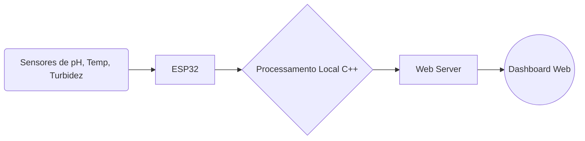

# Hydrosense 🌊

Sistema de monitoramento de qualidade da água desenvolvido para o ESP32. O sistema efetua a leitura de múltiplos sensores em tempo real e fornece uma interface Web local (Dashboard) para acompanhamento dinâmico dos parâmetros.

## 📋 Organização do Projeto

```text
esp32_hydrosense/
├── esp32_hydrosense.ino      # Código principal C++ responsável por leitura e web server
└── webpage.h                 # Interface do dashboard encapsulada (HTML/CSS/JS)
```

## 🚀 Como Iniciar

1. Abra a pasta do projeto e dê um duplo clique em `esp32_hydrosense.ino` no Arduino IDE.
2. Certifique-se de ter a placa ESP32 devidamente instalada na sua IDE.
3. Conecte sua placa ESP32 via USB e faça upload do código.
4. Pelo seu smartphone ou computador, conecte-se à rede Wi-Fi gerada pelo ESP32:
   - **SSID**: `AquaAnalyzer_AP`
   - **Senha**: `12345678`
5. Acesse `http://192.168.1.237` no seu navegador favorito.

✅ **Pronto!** O sistema exibirá imediatamente o dashboard de visualização dos dados.

## 📊 Arquitetura e Fluxo



## 🔧 Configuração de Hardware

Para reproduzir localmente as conexões físicas (que constam no código padrão):

- **Temperatura (Sensor Dallas)**: GPIO 4
- **Sensor Laser (Alimentação Turbidez)**: GPIO 2
- **LDR (Leitura de Turbidez)**: GPIO 36 (ADC1_CH0)
- **Sensor de pH**: GPIO 34 (ADC1_CH6)

*(Para alterar estes ou outros parâmetros, como o nome/senha da rede WiFi, basta editar as variáveis declaradas logo no início de `esp32_hydrosense.ino`)*

## 📄 Licença

Este projeto faz parte do Hydrosense, desenvolvido por estudantes do Instituto Médio Privado Politécnico do Huambo.

## 👥 Autores

- Amorim Caculo
- Marcier Rocha  
- Onezimo Cambuta
